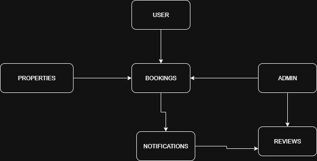

# Airbnb Clone - Features & Functionalities

This document outlines the key backend features and functionalities of the Airbnb Clone project.

## Core Modules

### 1. User Authentication & Management
- Register, login, logout
- Profile management
- Password reset & update
- Role-based access (guest, host, admin)

### 2. Property Management
- Add, update, delete listings
- Manage property details (price, amenities, availability)
- Search and filter properties

### 3. Booking System
- Create, modify, and cancel bookings
- Check availability
- Booking history

### 4. Payments
- Payment gateway integration (Stripe/PayPal)
- Secure checkout
- Refunds & cancellations
- Payment history
- Host payouts

### 5. Reviews & Ratings
- Guest reviews for properties
- Host reviews for guests
- Star rating system

### 6. Notifications
- Email and SMS alerts
- In-app notifications

### 7. Admin Panel
- Manage users and listings
- Approve or reject properties
- Monitor bookings and payments
- Reporting & analytics

## System Architecture Diagram
Below is the diagram showing the relationships between the core modules:

