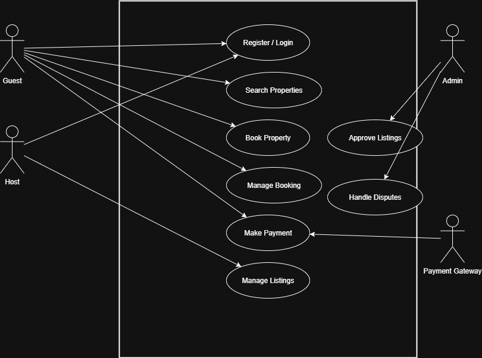

# Use Case Diagram - ALX Airbnb Project

This diagram visualizes the key system interactions for the **Airbnb Clone backend**.  
It shows how different actors interact with the system’s main functionalities.

---

## 🎭 Actors
- **Guest**: Registers, searches for properties, books, manages bookings, and makes payments.  
- **Host**: Registers and manages property listings.  
- **Admin**: Approves property listings and handles disputes.  
- **Payment Gateway**: Handles transactions securely.  

---

## 🗂️ Use Cases
- Register / Login  
- Search Properties  
- Book Property  
- Manage Booking (cancel/modify)  
- Make Payment  
- Manage Listings (for hosts)  
- Approve Listings (for admins)  
- Handle Disputes (for admins)  

---

## 📌 Diagram
Below is the use case diagram:

